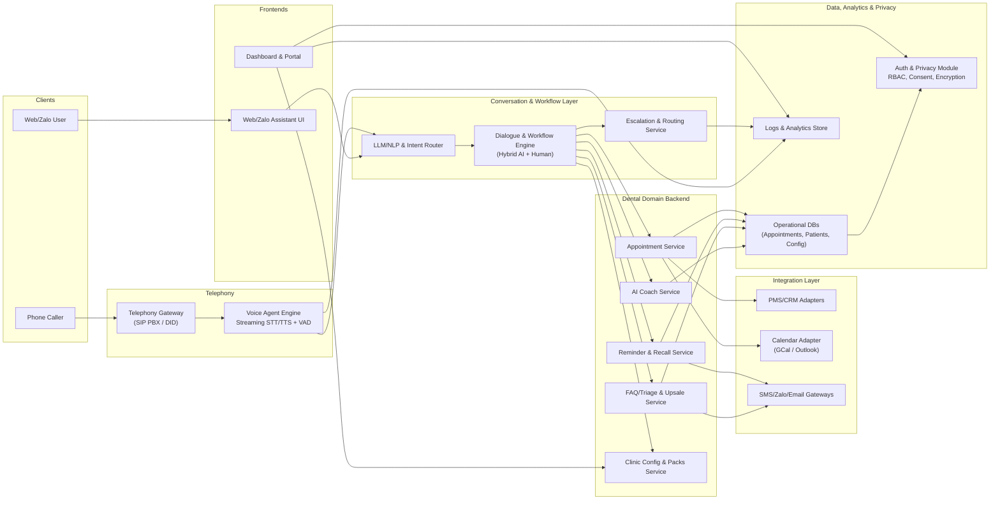

**Architecture**:

```mermaid

flowchart LR
  subgraph Clients
    P1[Phone Caller]
    P2[Web/Zalo User]
  end

  subgraph Telephony
    T1["Telephony Gateway<br>(SIP PBX / DID)"]
    V1["Voice Agent Engine<br>Streaming STT/TTS + VAD"]
  end

  subgraph CoreLogic[Conversation & Workflow Layer]
    C1["LLM/NLP & Intent Router"]
    C2["Dialogue & Workflow Engine\n(Hybrid AI + Human)"]
    C3["Escalation & Routing Service"]
  end

  subgraph Domain["Dental Domain Backend"]
    D1["Appointment Service"]
    D2["Reminder & Recall Service"]
    D3["FAQ/Triage & Upsale Service"]
    D4["AI Coach Service"]
    D5["Clinic Config & Packs Service"]
  end

  subgraph Integrations["Integration Layer"]
    I1["PMS/CRM Adapters"]
    I2["Calendar Adapter<br>(GCal / Outlook)"]
    I3["SMS/Zalo/Email Gateways"]
  end

  subgraph Frontends
    F1["Web/Zalo Assistant UI"]
    F2["Dashboard & Portal"]
  end

  subgraph Data["Data, Analytics & Privacy"]
    A1["Operational DBs<br>(Appointments, Patients, Config)"]
    A2["Logs & Analytics Store"]
    A3["Auth & Privacy Module<br>RBAC, Consent, Encryption"]
  end

  %% client flows
  P1 --> T1 --> V1 --> C1 --> C2
  P2 --> F1 --> C1

  %% core to domain
  C2 --> D1
  C2 --> D2
  C2 --> D3
  C2 --> D5
  C2 --> C3
  C2 --> D4

  %% domain to integrations
  D1 --> I1
  D1 --> I2
  D2 --> I3
  D3 --> I3

  %% dashboards
  F2 --> D5
  F2 --> A2
  F2 --> A3

  %% data & privacy
  D1 --> A1
  D2 --> A1
  D3 --> A1
  D4 --> A1
  C3 --> A2
  V1 --> A2
  A1 --> A3

```
