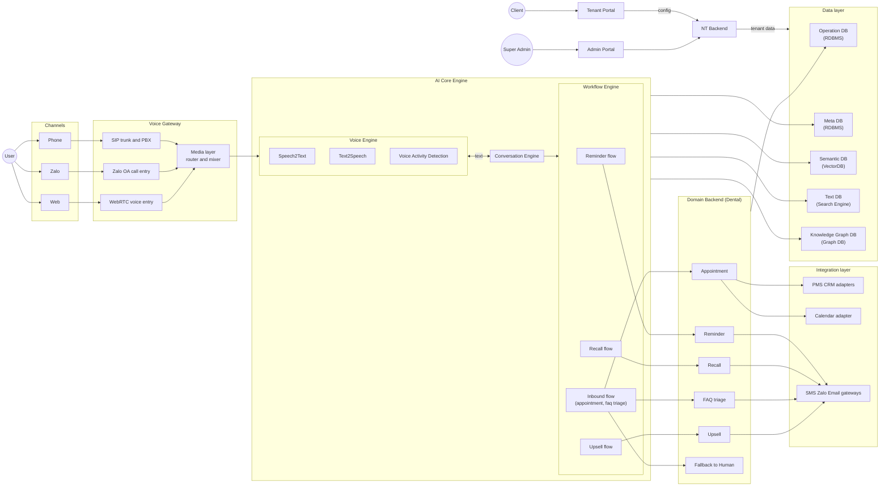

## Term & Glossary
- **User**: khách khám/chữa răng của các Clinic
- **Client**: phòng khám nha (Clinic), mỗi phòng khám coi là 1 Tenant. Tối thiểu có 2 roles: Tenant Admin (Clinic Owner) và Operator (lễ tân)
- **Super Admin**: Admin của NT, sẽ thực hiện đăng ký tạo Tenant, hỗ trợ config, các vấn đề về tài khoản...
- **Channel**: các kênh tương tác với user
  - **Phone**: Gọi điện thoại trực tiếp bằng điện thoai. Cần tích hợp qua "SIP Trunk và PBX"
  > SIP Trunk (Session Initiation Protocol Trunk) là phương thức kết nối tổng đài (PBX) với nhà mạng thông qua Internet thay vì đường dây điện thoại
  > 
  - **Zalo**: Gọi điện/chat qua nền tảng của Zalo. Cần tích hợp với ZaloOA
  > Tính năng gọi thoại (Voice) trên Zalo Official Account là giải pháp tương tác hai chiều giúp doanh nghiệp gọi trực tiếp đến người dùng (outbound) hoặc nhận cuộc gọi miễn phí từ khách hàng (inbound) thông qua hệ thống tổng đài ảo
  > 
  - **WebRTC**: Gọi điện qua nền tảng Web.
  > WebRTC (Web Real-Time Communications)
  >
- **Domain features**: Các nghiệp vụ của Client sẽ được hệ thống hỗ trợ/tự động hoá
  - **Appointment**: Đặt lịch hẹn khám/tái khám/chữa răng
  - **Reminder**: Gọi nhắc lịch hẹn sắp tới
  - **Recall**: Gọi nhắc tái khám định kỳ
  - **FAQ triage**: Quy trình đánh giá và phân loại các câu hỏi hoặc yêu cầu hỗ trợ của khách
  - **Upsell**: Tư vấn bán thêm dịch vụ nâng cao
  - **AI coach for staff**: Đào tạo và hỗ trợ Operator khi làm việc với User
  - TBD...
- **Operation systems**: Các hệ thống vệ tinh mà Clinic đang sử dụng. NT sẽ cần tích hợp với các hệ thống này để hoạt động được toàn trình
  - **Chat/Call**: Zalo, PBX
  - **Calendar**: Google Calendar,...
  - **Vận hành phòng khám**: PSM, CRM,...

## Architecture

### Actors

| Component | Loại | Mô tả |
| --- | --- | --- |
| User | Actor | Khách khám/chữa răng của các Clinic, tương tác qua Phone, Zalo hoặc Web |
| Client | Actor | Phòng khám nha (Clinic/Tenant), truy cập hệ thống qua Tenant Portal để cấu hình |
| Super Admin | Actor | Admin của NT, quản lý tạo Tenant, hỗ trợ config và tài khoản qua Admin Portal |

### Channels

| Component | Loại | Mô tả |
| --- | --- | --- |
| Phone | Channel | Kênh gọi điện thoại trực tiếp, kết nối vào hệ thống qua SIP trunk |
| Zalo | Channel | Kênh chat/gọi điện qua nền tảng Zalo, kết nối qua Zalo OA call entry |
| Web | Channel | Kênh gọi điện qua trình duyệt, kết nối qua WebRTC voice entry |

### Voice Gateway

| Component | Loại | Mô tả |
| --- | --- | --- |
| SIP trunk and PBX | Gateway adapter | Kết nối tổng đài PBX với nhà mạng qua Internet để nhận cuộc gọi từ Phone |
| Zalo OA call entry | Gateway adapter | Điểm vào cho tính năng gọi thoại hai chiều (inbound/outbound) trên Zalo OA |
| WebRTC voice entry | Gateway adapter | Điểm vào cho cuộc gọi thoại thời gian thực từ nền tảng Web |
| Media layer (router and mixer) | Gateway core | Tổng hợp và định tuyến luồng audio từ 3 nguồn (SIP, Zalo OA, WebRTC) trước khi đưa vào Voice Engine |

### Portals & Backend chung

| Component | Loại | Mô tả |
| --- | --- | --- |
| [Tenant Portal](./tenant_portal.md) | Portal | Giao diện để Client (Clinic Owner/Operator) cấu hình dịch vụ, gửi config tới NT Backend |
| [Admin Portal](./admin_portal.md) | Portal | Giao diện để Super Admin quản lý tenant, tài khoản, cấu hình hệ thống |
| NT Backend | Backend core | Xử lý logic quản trị tenant, nhận config từ 2 portal và ghi dữ liệu vào Data layer |

### AI Core Engine

| Component | Loại | Mô tả |
| --- | --- | --- |
| Speech2Text (STT) | Voice Engine | Chuyển giọng nói từ Media layer thành văn bản để xử lý |
| Text2Speech (TTS) | Voice Engine | Chuyển phản hồi văn bản từ Conversation Engine thành giọng nói trả về user |
| Voice Activity Detection (VAD) | Voice Engine | Phát hiện thời điểm người dùng đang nói để xử lý ngắt lời/turn-taking |
| Conversation Engine | Core engine | Xử lý hội thoại (NLU/dialogue management), nhận text từ Voice Engine và điều phối tới Workflow Engine |
| Reminder flow | Workflow Engine | Kịch bản gọi nhắc lịch hẹn sắp tới |
| Recall flow | Workflow Engine | Kịch bản gọi nhắc tái khám định kỳ |
| Upsell flow | Workflow Engine | Kịch bản tư vấn bán thêm dịch vụ |
| Inbound flow (appointment, faq triage) | Workflow Engine | Kịch bản xử lý cuộc gọi đến: đặt lịch hẹn và phân loại câu hỏi/FAQ |

### Data Layer

| Component | Loại | Mô tả |
| --- | --- | --- |
| Operation DB (RDBMS) | Data store | Lưu dữ liệu vận hành nghiệp vụ từ Domain Backend |
| Meta DB (RDBMS) | Data store | Lưu metadata phục vụ AI Core Engine |
| Semantic DB (VectorDB) | Data store | Lưu vector embedding phục vụ tìm kiếm ngữ nghĩa cho AI Core Engine |
| Text DB (Search Engine) | Data store | Lưu dữ liệu văn bản phục vụ tìm kiếm full-text |
| Knowledge Graph DB (Graph DB) | Data store | Lưu dữ liệu dạng đồ thị tri thức phục vụ AI Core Engine |

### Domain Backend (Dental)

| Component | Loại | Mô tả |
| --- | --- | --- |
| Appointment | Domain service | Xử lý nghiệp vụ đặt lịch hẹn khám/tái khám/chữa răng |
| Reminder | Domain service | Xử lý nghiệp vụ nhắc lịch hẹn |
| Recall | Domain service | Xử lý nghiệp vụ nhắc tái khám định kỳ |
| FAQ triage | Domain service | Xử lý phân loại và đánh giá câu hỏi/yêu cầu hỗ trợ |
| Upsell | Domain service | Xử lý nghiệp vụ tư vấn bán thêm dịch vụ |
| Fallback to Human | Domain service | Chuyển cuộc gọi/hội thoại sang nhân viên thật khi AI không xử lý được |

### Integration Layer

| Component | Loại | Mô tả |
| --- | --- | --- |
| PMS/CRM adapters | Adapter | Tích hợp với các hệ thống vận hành phòng khám (PMS, CRM) |
| Calendar adapter | Adapter | Tích hợp với hệ thống lịch (Google Calendar,...) |
| SMS/Zalo/Email gateways | Adapter | Gửi thông báo/nhắc nhở qua các kênh SMS, Zalo, Email |

