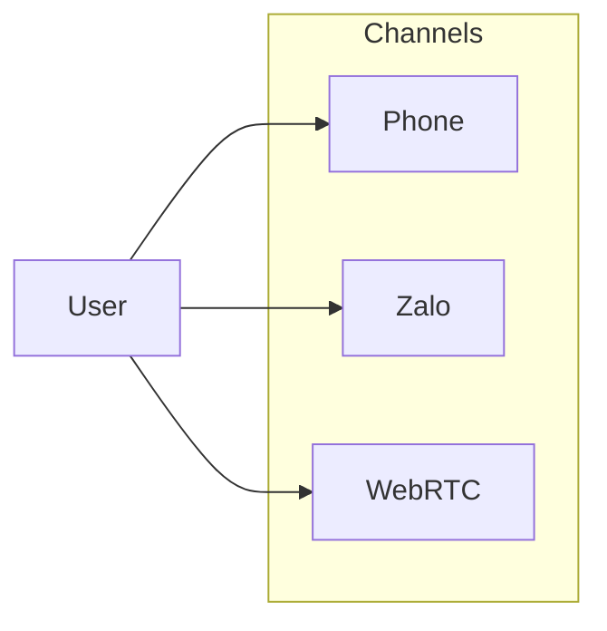

## Term & Glossary
- **User**: khách khám/chữa răng của các Clinic
- **Client**: phòng khám nha (Clinic), mỗi phòng khám coi là 1 Tenant. Tối thiểu có 2 roles: Tenant Admin (Clinic Owner) và Operator (lễ tân)
- **Super Admin**: Admin của NT, sẽ thực hiện đăng ký tạo Tenant, hỗ trợ config, các vấn đề về tài khoản...
- **Channel**: các kênh tương tác với user
  - **Phone**: Gọi điện thoại trực tiếp bằng điện thoai. Cần tích hợp qua "SIP Trunk và PBX"
  > SIP Trunk (Session Initiation Protocol Trunk) là phương thức kết nối tổng đài (PBX) với nhà mạng thông qua Internet thay vì đường dây điện thoại
  > 
  - **Zalo**: Gọi điện/chat qua nền tảng của Zalo. Cần tích hợp với ZaloOA
  > Tính năng gọi thoại (Voice) trên Zalo Official Account là giải pháp tương tác hai chiều giúp doanh nghiệp gọi trực tiếp đến người dùng (outbound) hoặc nhận cuộc gọi miễn phí từ khách hàng (inbound) thông qua hệ thống tổng đài ảo
  > 
  - **WebRTC**: Gọi điện qua nền tảng Web.
  > WebRTC (Web Real-Time Communications)
  >
- **Domain features**: Các nghiệp vụ của Client sẽ được hệ thống hỗ trợ/tự động hoá
  - **Appointment**: Đặt lịch hẹn khám/tái khám/chữa răng
  - **Reminder**: Gọi nhắc lịch hẹn sắp tới
  - **Recall**: Gọi nhắc tái khám định kỳ
  - **FAQ triage**: Quy trình đánh giá và phân loại các câu hỏi hoặc yêu cầu hỗ trợ của khách
  - **Upsell**: Tư vấn bán thêm dịch vụ nâng cao
  - **AI coach for staff**: Đào tạo và hỗ trợ Operator khi làm việc với User
  - TBD...
- **Operation systems**: Các hệ thống vệ tinh mà Clinic đang sử dụng. NT sẽ cần tích hợp với các hệ thống này để hoạt động được toàn trình
  - **Chat/Call**: Zalo, PBX
  - **Calendar**: Google Calendar,...
  - **Vận hành phòng khám**: PSM, CRM,...

## Components

