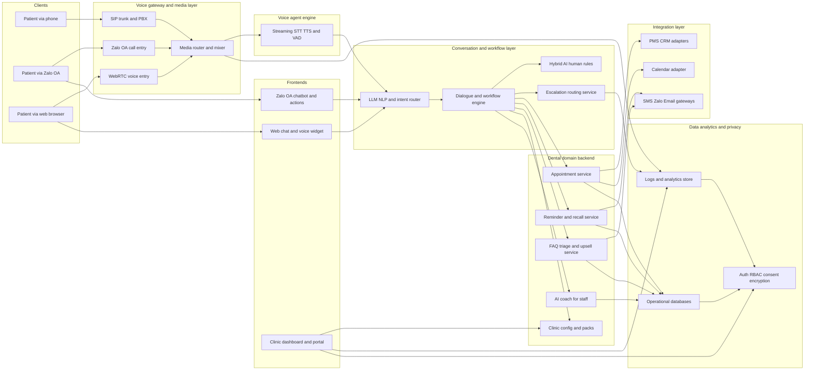

```mermaid

flowchart LR
  %% Clients
  subgraph Clients
    P_phone[Patient via phone]
    P_zalo[Patient via Zalo OA]
    P_web[Patient via web browser]
  end

  %% Voice entry (multi channel)
  subgraph VoiceGateway[Voice gateway and media layer]
    VG_sip[SIP trunk and PBX]
    VG_zalo[Zalo OA call entry]
    VG_webrtc[WebRTC voice entry]
    VG_router[Media router and mixer]
  end

  %% Core voice agent
  subgraph VoiceAgent[Voice agent engine]
    VA_stttts[Streaming STT TTS and VAD]
  end

  %% Conversation and workflow
  subgraph CoreLogic[Conversation and workflow layer]
    CL_nlp[LLM NLP and intent router]
    CL_flow[Dialogue and workflow engine]
    CL_hybrid[Hybrid AI human rules]
    CL_escalation[Escalation routing service]
  end

  %% Dental domain backend
  subgraph Domain[Dental domain backend]
    D_apt[Appointment service]
    D_rem[Reminder and recall service]
    D_faq[FAQ triage and upsell service]
    D_coach[AI coach for staff]
    D_cfg[Clinic config and packs]
  end

  %% Integrations
  subgraph Integrations[Integration layer]
    I_pms[PMS CRM adapters]
    I_cal[Calendar adapter]
    I_msg[SMS Zalo Email gateways]
  end

  %% Frontends
  subgraph Frontends
    F_webui[Web chat and voice widget]
    F_zaloUI[Zalo OA chatbot and actions]
    F_dash[Clinic dashboard and portal]
  end

  %% Data and privacy
  subgraph DataPrivacy[Data analytics and privacy]
    DP_db[Operational databases]
    DP_logs[Logs and analytics store]
    DP_auth[Auth RBAC consent encryption]
  end

  %% Flows from clients to gateway
  P_phone --> VG_sip
  P_zalo --> VG_zalo
  P_web --> VG_webrtc

  VG_sip --> VG_router
  VG_zalo --> VG_router
  VG_webrtc --> VG_router

  VG_router --> VA_stttts

  %% Voice agent to core logic
  VA_stttts --> CL_nlp
  CL_nlp --> CL_flow
  CL_flow --> CL_hybrid
  CL_flow --> CL_escalation

  %% Core logic to domain services
  CL_flow --> D_apt
  CL_flow --> D_rem
  CL_flow --> D_faq
  CL_flow --> D_cfg
  CL_flow --> D_coach

  %% Domain to integrations
  D_apt --> I_pms
  D_apt --> I_cal
  D_rem --> I_msg
  D_faq --> I_msg

  %% Frontends connections
  P_web --> F_webui
  P_zalo --> F_zaloUI

  F_webui --> CL_nlp
  F_zaloUI --> CL_nlp

  F_dash --> D_cfg
  F_dash --> DP_logs
  F_dash --> DP_auth

  %% Data and privacy links
  D_apt --> DP_db
  D_rem --> DP_db
  D_faq --> DP_db
  D_coach --> DP_db
  CL_escalation --> DP_logs
  VG_router --> DP_logs

  DP_db --> DP_auth
  DP_logs --> DP_auth

```

