# Tài liệu quy trình & nghiệp vụ kế toán cho chuyển đổi số và AI

Đối tượng: AI Leader, Business Analyst  
Mục tiêu: Nắm được **bức tranh end-to-end của kế toán doanh nghiệp**, các **quy trình – nghiệp vụ chuẩn** và **điểm chạm** để thiết kế hệ thống số hóa, tự động hóa và ứng dụng AI hiệu quả.

---

## 1. Bức tranh tổng thể quy trình kế toán doanh nghiệp

Ở mức khái quát, một chu trình kế toán doanh nghiệp đi từ **nghiệp vụ kinh tế phát sinh → chứng từ → ghi nhận → tổng hợp → báo cáo tài chính → phân tích & ra quyết định**.   

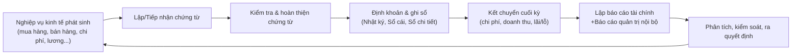

- **Chứng từ** là điểm đầu vào bắt buộc (invoice, phiếu thu/chi, hợp đồng…).    
- **Ghi sổ** gồm nhật ký chung, sổ cái, sổ chi tiết, bảng cân đối số phát sinh.     
- **Báo cáo tài chính**: Bảng cân đối kế toán, KQKD, Lưu chuyển tiền tệ, Thuyết minh BCTC.     

---

## 2. Các “domain” nghiệp vụ kế toán chính

Trong doanh nghiệp vừa và nhỏ có thể gom thành 6 domain nghiệp vụ cơ bản.   

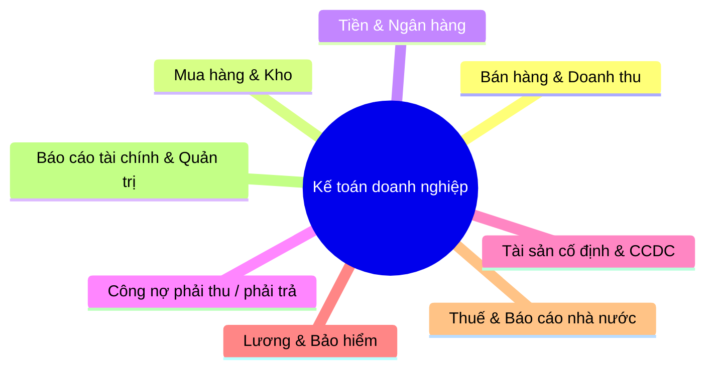

Mỗi domain bên dưới sẽ có:  
- Nghiệp vụ chính  
- Dòng dữ liệu – chứng từ  
- Điểm tự động hóa & AI tiềm năng

---

## 3. Quy trình xử lý chứng từ kế toán (Document Pipeline)

Đây là “ingestion pipeline” của hệ thống kế toán – chỗ rất giàu cơ hội dùng OCR, RPA, LLM.   

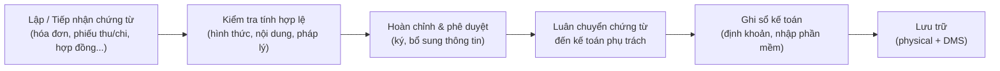

- Bước 1–2: tập hợp chứng từ từ nội bộ, nhà cung cấp, khách hàng.    
- Bước 3: kiểm tra hợp lệ/hợp pháp trước khi ghi sổ, sai thì trả lại/điều chỉnh.    
- Bước 4–6: luân chuyển, định khoản, ghi sổ trên phần mềm, lưu trữ theo quy định.     

**Điểm AI/digital:**

- OCR + LLM nhận dạng hóa đơn, auto mapping loại giao dịch, đề xuất bút toán.    
- Rule engine/ML kiểm tra bất thường (thiếu trường, số tiền lệch, nhà cung cấp blacklist…).    
- DMS + search semantic để truy vấn chứng từ nhanh.

---

## 4. Chu trình kế toán tổng thể theo kỳ (tháng/quý/năm)

Chu trình kế toán theo kỳ tập trung vào việc **tổng hợp số liệu, kết chuyển, lập BCTC**.    

```mermaid
flowchart LR
    A1["Tập hợp nghiệp vụ phát sinh\ntrong kỳ"] --> A2["Kiểm tra, phân loại chứng từ"]
    A2 --> A3["Định khoản & ghi sổ\nNhật ký, Sổ cái, Sổ chi tiết"]
    A3 --> A4["Rà soát, đối chiếu\n(kho, ngân hàng, công nợ)"]
    A4 --> A5["Bút toán điều chỉnh & kết chuyển\n(chi phí, doanh thu, lãi/lỗ)"]
    A5 --> A6["Lập Bảng cân đối số phát sinh"]
    A6 --> A7["Lập Báo cáo tài chính\n+Báo cáo thuế"]F
    A7 --> A8["Phân tích & trình ký\nBan giám đốc, cơ quan nhà nước"]
```

Theo các nguồn, quy trình chuẩn thường gồm: **thu thập → hạch toán → phân loại theo kỳ → rà soát → bút toán cuối kỳ → lập BCTC → nộp báo cáo**.     

---

## 5. Nghiệp vụ theo từng domain (view cho BA/AI leader)

### 5.1. Kế toán bán hàng & doanh thu

Core: ghi nhận doanh thu, thuế GTGT đầu ra, công nợ khách hàng, giá vốn hàng bán.   

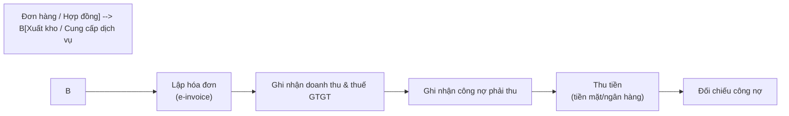

Nghiệp vụ chính:     
- Ghi nhận doanh thu, thuế GTGT, giá vốn.  
- Theo dõi công nợ phải thu, đối chiếu với khách hàng.  
- Báo cáo doanh số, cơ cấu sản phẩm/kênh.

**Điểm AI/digital:**

- Auto reconcile đơn hàng – giao nhận – hóa đơn – thu tiền.  
- Phát hiện giao dịch bất thường (bán dưới giá vốn, chiết khấu lạ…).    
- Dự báo doanh thu, cảnh báo khách hàng có rủi ro nợ xấu.   

---

### 5.2. Kế toán mua hàng & kho

Quản lý luồng: yêu cầu mua → đặt hàng → nhận hàng → nhập kho → thanh toán → hạch toán chi phí.   

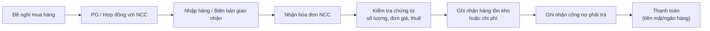

Nghiệp vụ:     
- Ghi nhận mua hàng, nhập kho, thuế GTGT đầu vào.  
- Tính giá vốn hàng xuất kho.  
- Theo dõi công nợ phải trả nhà cung cấp.

**Điểm AI/digital:**

- Tự động đọc PO – invoice – GRN để đối chiếu 3 chiều (3-way matching).  
- Đề xuất giá mua tối ưu, phát hiện nhà cung cấp bất thường (thay đổi đơn giá, điều khoản).     

---

### 5.3. Tiền mặt & ngân hàng (Cash & Bank)

Quản lý dòng tiền: thu – chi – đối chiếu sao kê ngân hàng – tồn quỹ.  

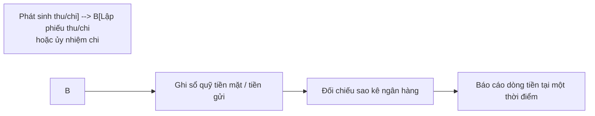

Nghiệp vụ chính:    
- Ghi nhận thu chi tiền mặt, tiền gửi.  
- Đối chiếu với sổ phụ ngân hàng.  
- Tổng hợp số liệu cho báo cáo lưu chuyển tiền tệ.

**Điểm AI/digital:**

- Auto mapping giao dịch ngân hàng vào sổ cái (categorization).  
- Phân tích pattern dòng tiền, cảnh báo thiếu hụt, dự báo dòng tiền.   

---

### 5.4. Công nợ phải thu / phải trả

Theo dõi từng đối tượng (khách hàng, nhà cung cấp) và từng hóa đơn.    

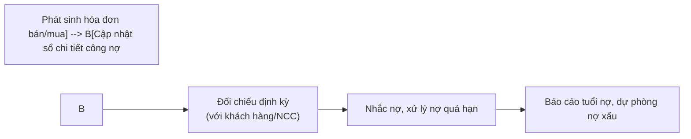

Nghiệp vụ:     
- Mở sổ chi tiết, theo dõi từng hóa đơn.  
- Đối chiếu định kỳ, lập biên bản đối chiếu.  
- Đề xuất trích lập dự phòng, xử lý nợ khó đòi.

**Điểm AI/digital:**

- Scoring rủi ro công nợ, dự báo khả năng chậm trả.  
- Workflow tự động gửi nhắc nợ, đề xuất chính sách tín dụng khách hàng.    

---

### 5.5. Tài sản cố định (TSCĐ) & CCDC

Quản lý vòng đời tài sản: ghi tăng – khấu hao – thanh lý.  

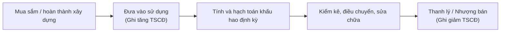

Nghiệp vụ:    
- Ghi nhận nguyên giá, thời gian sử dụng, phương pháp khấu hao.  
- Hạch toán khấu hao định kỳ.  
- Ghi giảm khi thanh lý/nhượng bán.

**Điểm AI/digital:**

- Quản lý tài sản với QR/IoT, tự động đồng bộ tình trạng sử dụng.    
- AI tối ưu kế hoạch đầu tư – thay thế tài sản, phân tích chi phí – lợi ích.    

---

### 5.6. Lương & bảo hiểm

Gắn với HR nhưng tạo khối nghiệp vụ lớn cho kế toán.  

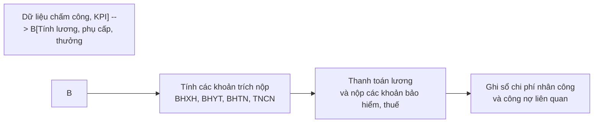

Nghiệp vụ:    
- Tính lương, bảo hiểm, thuế TNCN.  
- Hạch toán chi phí nhân công.  

**Điểm AI/digital:**

- Tự động tính lương từ dữ liệu chấm công/kPI.  
- LLM hỗ trợ giải thích quy định thuế TNCN, mô phỏng kịch bản net/gross.    

---

### 5.7. Thuế & báo cáo nhà nước

Bao gồm VAT, CIT, PIT, báo cáo tình hình sử dụng hóa đơn, BCTC nộp cơ quan thuế.   

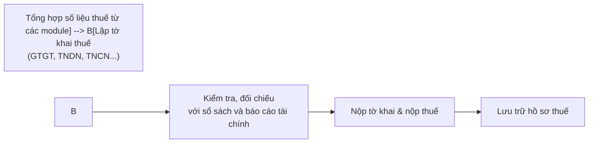

Nghiệp vụ:     
- Lập tờ khai định kỳ (tháng/quý/năm).  
- Quyết toán thuế, giải trình số liệu khi thanh tra.

**Điểm AI/digital:**

- Tự động sinh tờ khai từ ledger, kiểm tra chéo với chứng từ.  
- Chatbot giải đáp quy định thuế, gợi ý bút toán xử lý vướng mắc.     

---

### 5.8. Báo cáo tài chính & báo cáo quản trị

Đỉnh chuỗi giá trị dữ liệu kế toán.      

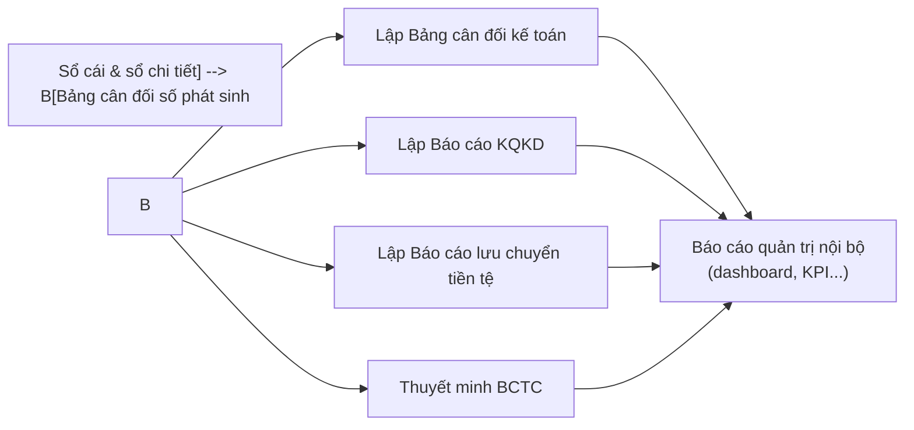

Theo các hướng dẫn thực hành, quy trình lập BCTC gồm: sắp xếp chứng từ, hạch toán, phân loại theo kỳ, rà soát, bút toán kết chuyển, rồi lập bộ báo cáo đầy đủ.   

**Điểm AI/digital:**

- Sinh báo cáo tài chính tự động từ ledger, khai XML HTKK/e-tax.    
- LLM tạo bảng phân tích, narrative insight cho ban lãnh đạo (storytelling báo cáo).    

---

## 6. Chuyển đổi số trong kế toán: khung nhìn kiến trúc

### 6.1. Định nghĩa & phạm vi

Chuyển đổi số trong kế toán là quá trình **chuyển mô hình kế toán truyền thống sang mô hình kế toán số** dựa trên các công nghệ IoT, Big Data, Blockchain, Cloud… để thay đổi phương thức xử lý, cung cấp thông tin, nâng cao hiệu quả và tạo giá trị mới.   

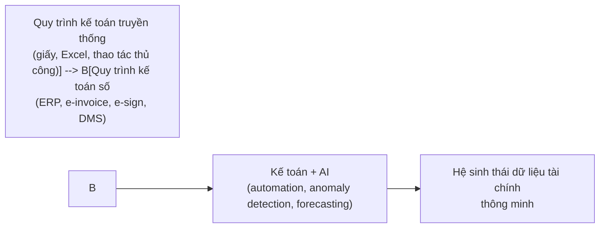

---

### 6.2. Layer kiến trúc dữ liệu & ứng dụng

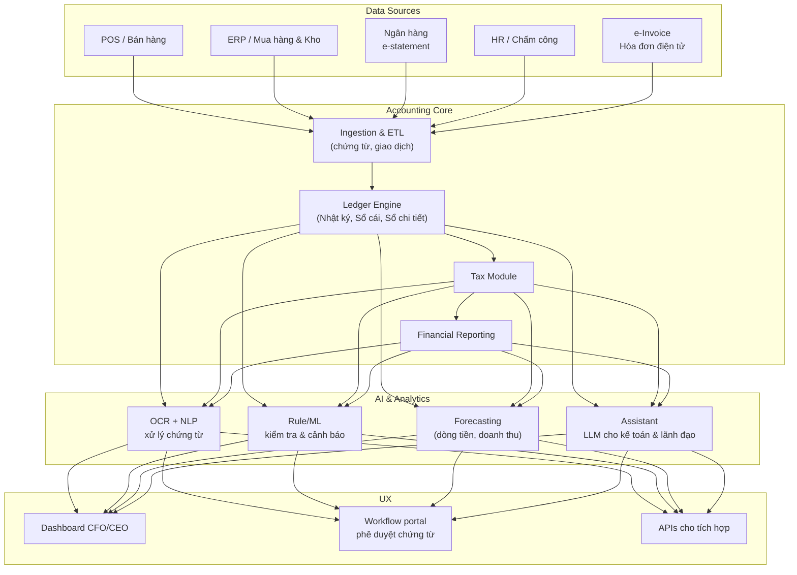

---

## 7. Ma trận “Nghiệp vụ kế toán × Cơ hội AI”

Bảng này giúp BA/AI leader mapping từ **use case nghiệp vụ → loại AI thích hợp**.

| Domain nghiệp vụ | Bài toán cụ thể | Loại AI/tech phù hợp |
| --- | --- | --- |
| Chứng từ | OCR hóa đơn, phân loại chứng từ, đề xuất định khoản | OCR, NLP, LLM, rule-based + ML    |
| Bán hàng | Phát hiện giao dịch bất thường, phân tích biên lợi nhuận | Anomaly detection, BI + ML   |
| Mua hàng & kho | 3-way matching PO – GRN – Invoice, tối ưu mức tồn kho | Constraint optimization, ML    |
| Cash & bank | Auto categorize transaction, dự báo dòng tiền | Time series forecasting   |
| Công nợ | Scoring khách hàng, dự báo nợ xấu | Classification, survival analysis    |
| TSCĐ | Đề xuất kế hoạch đầu tư/ thay thế, phân tích chi phí – lợi ích | Simulation, scenario analysis    |
| Lương & thuế TNCN | Tư vấn cấu trúc lương, kiểm tra tuân thủ luật | LLM + RAG, rule engine    |
| Thuế & báo cáo | Sinh tờ khai tự động, tra cứu văn bản thuế | LLM + RAG, form filling     |
| BCTC & quản trị | Tự động sinh narrative báo cáo, what-if analysis | LLM, financial modeling    |

---

## 8. Checklist kiến thức tối thiểu cho dự án AI hóa kế toán

Để thiết kế giải pháp chuyển đổi số/AI thực tế trong kế toán, AI Leader/BA nên nắm tối thiểu:

1. **Hiểu quy trình kế toán end-to-end** (mục 1–4): từ chứng từ đến BCTC.      
2. **Hiểu các domain nghiệp vụ chính và các loại nghiệp vụ kế toán cơ bản**: bán hàng, mua hàng, kho, tiền, công nợ, TSCĐ, lương, thuế.     
3. **Nắm được quy trình xử lý chứng từ và luân chuyển chứng từ**: điểm nào có rủi ro, điểm nào có thể số hóa 100%.     
4. **Hiểu khái niệm chuyển đổi số trong kế toán/kiểm toán**: từ mô hình truyền thống sang kế toán số, kết hợp công nghệ IoT, Big Data, Cloud, Blockchain.     
5. **Có khung kiến trúc dữ liệu & ứng dụng**: nguồn dữ liệu, ledger core, tax, reporting, layer AI, dashboard.    
6. **Có ma trận use case AI × nghiệp vụ**: ưu tiên những chỗ tốn effort thủ công, dễ chuẩn hóa, nhiều dữ liệu lịch sử.     

Với bộ diagram và cấu trúc trên, người đọc từ đầu tới cuối sẽ:

- Nhìn được **data flow** và **process flow** của kế toán.  
- Mapping được **nghiệp vụ kế toán** sang **module hệ thống & AI use case**.  
- Đủ kiến thức để bắt đầu **thiết kế kiến trúc, backlog tính năng, và lộ trình triển khai** cho một dự án chuyển đổi số kế toán/AI-first accounting.

# Note

## Các domain có thể có thêm tại các doanh nghiệp, tập đoàn lớn

### Kế toán tập đoàn & hợp nhất báo cáo
- Tập đoàn phải lập Báo cáo tài chính hợp nhất (BCTC hợp nhất), cộng từng chỉ tiêu tài sản, nợ phải trả, vốn chủ, doanh thu, chi phí của công ty mẹ và các công ty con rồi điều chỉnh giao dịch nội bộ theo chuẩn mực như VAS 25.
- Có thêm nghiệp vụ: xác định quyền kiểm soát, loại trừ giao dịch nội bộ, ghi nhận lợi ích cổ đông không kiểm soát, xử lý công ty con khác kỳ kế toán/khác đồng tiền báo cáo.

### Kế toán quản trị đa chiều
- Ở doanh nghiệp lớn, kế toán quản trị được tổ chức thành hệ thống riêng với nhiều lớp thông tin: chi phí, thu nhập, lợi nhuận theo bộ phận, sản phẩm, kênh, thị trường… để phục vụ lập kế hoạch, ngân sách và ra quyết định.
- Thường chia thành nhiều cấp: bộ phận kế toán quản trị trực thuộc tổng giám đốc và các bộ phận trực thuộc giám đốc từng đơn vị, theo dõi chi phí – hiệu quả theo trung tâm chi phí, trung tâm lợi nhuận, dự án, chương trình.

### Kế toán giá thành & chi phí phức tạp
- Doanh nghiệp sản xuất lớn thường có hệ thống kế toán chi phí và tính giá thành đa giai đoạn, tập hợp chi phí theo bộ phận/công đoạn và áp dụng nhiều phương pháp tính giá thành (giản đơn, hệ số, phân bước, theo đơn hàng…).
- Giá thành có thể phải tính tới cấp sản phẩm, dòng sản phẩm, khách hàng, khu vực, làm đầu vào cho quyết định pricing, tối ưu cấu trúc sản phẩm và chiến lược thị trường.

### Kế toán công cụ tài chính & phái sinh
- Doanh nghiệp lớn (đặc biệt là có vay nợ, ngoại tệ, lãi suất, hàng hóa) phát sinh công cụ tài chính phái sinh (hợp đồng kỳ hạn, hoán đổi, quyền chọn…) và phải hạch toán theo mục đích: kinh doanh hay phòng ngừa rủi ro.
- Việc hạch toán phái sinh đòi hỏi phân loại tài sản/nợ tài chính theo “giá trị hợp lý”, ghi nhận lãi/lỗ do thay đổi giá trị và, nếu là hedging, phải lập hồ sơ phòng ngừa rủi ro, đánh giá hiệu quả phòng ngừa định kỳ.

### Kế toán giao dịch liên kết & chuyển giá
- Tập đoàn đa công ty con, đặc biệt đa quốc gia, phải xử lý giao dịch liên kết và chuyển giá (transfer pricing): xác định giá cho giao dịch nội bộ hàng hóa/dịch vụ/tài chính sao cho phù hợp nguyên tắc giao dịch độc lập và quy định thuế.
- Doanh nghiệp phải lập hồ sơ giao dịch liên kết, báo cáo lợi nhuận liên quốc gia, giải trình chính sách phân bổ lợi nhuận và giá nội bộ với cơ quan thuế.

### Treasury, đầu tư & rủi ro tài chính
- Doanh nghiệp lớn thường có bộ phận treasury riêng phụ trách quản lý thanh khoản, đầu tư ngắn hạn, cấu trúc nợ – vốn, và phòng ngừa rủi ro tỷ giá, lãi suất.
-  Kế toán phải theo dõi danh mục đầu tư tài chính, các khoản vay phức tạp, chi phí lãi vay, cấu trúc kỳ hạn, đồng tiền, phục vụ cho các quyết định vốn và chiến lược tài chính dài hạn.

### Summary
Tóm lại: 6 domain ở SME là “lớp core”, còn ở doanh nghiệp lớn/tập đoàn sẽ thêm kế toán tập đoàn & hợp nhất, kế toán quản trị đa chiều, chi phí–giá thành phức tạp, công cụ tài chính/phái sinh, chuyển giá & giao dịch liên kết, treasury & quản trị rủi ro tài chính nằm trên hoặc cắt ngang những domain đó

## Terms

| Thuật ngữ                                               | Giải thích ngắn                                                                                                                                                         |
| ------------------------------------------------------- | ----------------------------------------------------------------------------------------------------------------------------------------------------------------------- |
| Tài sản (Assets)                                        | Nguồn lực doanh nghiệp kiểm soát và dự kiến mang lại lợi ích kinh tế tương lai (tiền, hàng tồn kho, máy móc, quyền sử dụng đất…).                  |
| Nợ phải trả (Liabilities)                               | Nghĩa vụ tài chính hiện tại, phát sinh từ giao dịch đã qua, doanh nghiệp phải thanh toán bằng nguồn lực của mình (vay, nợ nhà cung cấp, thuế phải nộp…).|
| Vốn chủ sở hữu (Equity)                                 | Phần “thuộc về chủ” = Tài sản − Nợ phải trả; gồm vốn góp, lợi nhuận giữ lại, các quỹ…                  |
| Doanh thu (Revenue)                                     | Tổng lợi ích kinh tế thu được trong kỳ từ hoạt động kinh doanh chính và hoạt động khác, làm tăng vốn chủ sở hữu, không tính phần chủ góp vốn. |
| Chi phí (Expenses)                                      | Các khoản làm giảm lợi ích kinh tế trong kỳ (chi tiền, hao mòn tài sản, phát sinh nợ…), dẫn đến giảm vốn chủ sở hữu, không bao gồm phần chia cho chủ. |
| Lợi nhuận/Lãi (Profit)                                  | Kết quả dương: Doanh thu − Chi phí > 0 trong một kỳ kế toán. |
| Lỗ (Loss)                                               | Kết quả âm: Doanh thu − Chi phí < 0 trong kỳ kế toán. |
| Năm tài chính (Fiscal year)                             | Khoảng 12 tháng dùng làm đơn vị báo cáo kế toán và thuế; có thể trùng hoặc khác năm dương lịch. |
| Kỳ kế toán (Accounting period)                          | Khoảng thời gian doanh nghiệp “chốt sổ” để lập báo cáo (tháng, quý, năm). |
| Báo cáo tài chính (Financial statements)                | Bộ báo cáo chuẩn thể hiện tình hình tài chính và kết quả kinh doanh: Bảng cân đối, Báo cáo KQKD, Lưu chuyển tiền tệ, Thuyết minh. |
| Báo cáo tài chính hợp nhất                              | Báo cáo tài chính của tập đoàn, hợp nhất công ty mẹ và các công ty con như một doanh nghiệp duy nhất, loại trừ giao dịch nội bộ. |
| Bảng cân đối kế toán (Balance sheet)                    | Báo cáo chụp tại một thời điểm: Tài sản = Nợ phải trả + Vốn chủ sở hữu. |
| Báo cáo kết quả hoạt động kinh doanh (Income statement) | Báo cáo lãi/lỗ trong một kỳ: thể hiện doanh thu, chi phí, lợi nhuận hoặc lỗ. |
| Báo cáo lưu chuyển tiền tệ (Cash flow statement)        | Báo cáo dòng tiền vào/ra, phân loại theo hoạt động kinh doanh – đầu tư – tài chính. |

### Bút toán:
- Bút toán (journal entry) là một ghi chép kế toán về một nghiệp vụ kinh tế vào sổ kế toán.
- Mỗi bút toán gồm ít nhất 2 dòng: một hoặc nhiều dòng bên Nợ và một hoặc nhiều dòng bên Có; tổng số tiền bên Nợ = tổng số tiền bên Có. Nếu không cân thì bút toán bị coi là sai.
- Một nghiệp vụ kinh tế (real-life event) → một hoặc một vài bút toán (tùy hệ thống).
- Mỗi bút toán có thể chạm vào nhiều tài khoản; các tài khoản này chính là “columns” aggregatable trong ledger.
- Bút toán là đơn vị ghi nhận nhỏ nhất của hệ thống kế toán mà từ đó có thể aggregate lên sổ cái, BCTC, dashboard…
- Ví dụ: Một bút toán điển hình gồm:
    - Ngày hạch toán.
    - Số chứng từ, mô tả.
    - Danh sách dòng: mỗi dòng = {tài khoản, số tiền, Nợ/Có}.
    - Tổng Nợ = Tổng Có.
- Ví dụ nghiệp vụ: trả tiền điện 10 triệu bằng chuyển khoản ngân hàng.
    - Tài khoản chi phí điện: 642 (Chi phí quản lý doanh nghiệp).
    - Tài khoản tiền gửi ngân hàng: 112.
    - Bút toán:
        - Nợ 642: 10.000.000
        - Có 112: 10.000.000
- Quy trình để tạo một bút toán:
    1. Xác định nghiệp vụ phát sinh:
        - Có chứng từ: hóa đơn, phiếu thu/chi, hợp đồng…
    2. Phân tích nghiệp vụ:
        - Nghiệp vụ làm tài khoản nào tăng, tài khoản nào giảm, thuộc loại tài sản/nợ/doanh thu/chi phí/vốn.
    3. Lập định khoản:
        - Quyết định: tài khoản A ghi Nợ bao nhiêu, tài khoản B ghi Có bao nhiêu (có thể nhiều hơn 2 tài khoản).
    5. Ghi bút toán:
        - Ghi vào sổ nhật ký theo thời gian, sau đó cập nhật sổ cái từng tài khoản.
    6. Kiểm tra cân bằng:
        - Tổng Nợ = Tổng Có, nếu lệch là sai logic hệ thống double-entry.
