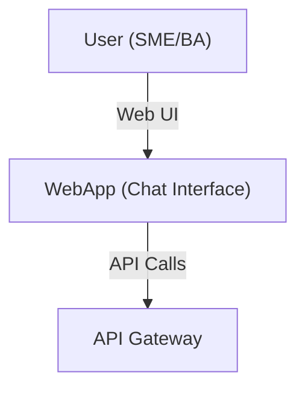

# 3.1 - Web App (Chat Interface)

## Vai trò
- Là giao diện người dùng chính cho cả SME (Software Engineer) và BA (Business Analyst).
- Cho phép SME upload source code, kiểm tra tri thức AI xây dựng, và tinh chỉnh lại.
- Cho phép BA đặt câu hỏi, nhận câu trả lời, và tạo tài liệu dựa trên tri thức đã xây dựng.

## Chức năng chính
- Đăng nhập/xác thực người dùng
- Upload source code dự án.
- Hiển thị, kiểm tra, và chỉnh sửa tri thức AI đã xây dựng.
- Giao tiếp chat với Assistant (QA, tạo tài liệu, v.v.).
- Hiển thị lịch sử tương tác, kết quả truy vấn, và các tài liệu sinh ra.

## Giao tiếp với các thành phần khác
- Giao tiếp trực tiếp với API Gateway (Backend Service) qua HTTP/WebSocket.
- Nhận phản hồi, kết quả, và trạng thái từ API Gateway.

## Sơ đồ minh họa

## Lưu ý đặc biệt
- UI cần thân thiện, dễ sử dụng cho cả kỹ thuật và phi kỹ thuật.
- Hỗ trợ upload dự án lớn, hiển thị tiến trình rõ ràng.
