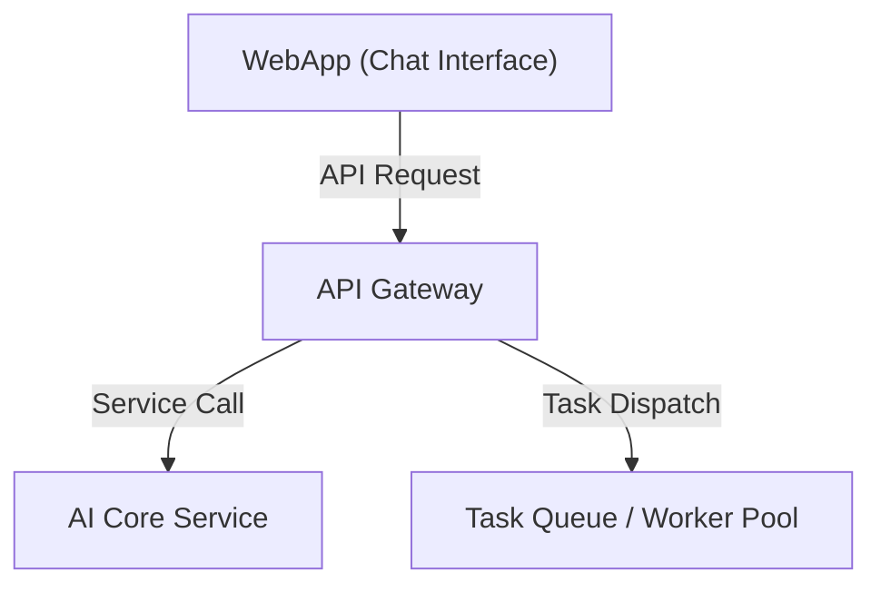

# 3.2 - API Gateway (Backend Service)

## Vai trò
- Là điểm tiếp nhận duy nhất cho tất cả các request từ WebApp (Frontend).
- Đóng vai trò trung gian, bảo vệ và điều phối các request đến các service phía sau (AI Core Service, Worker, v.v.).
- Thực hiện xác thực, phân quyền, kiểm soát truy cập.

## Chức năng chính
- Nhận và xác thực request từ WebApp (HTTP/WebSocket).
- Định tuyến request đến các service phù hợp (AI Core Service, Worker, ...).
- Quản lý session, token, bảo mật API.
- Xử lý các lỗi, trả về thông báo rõ ràng cho frontend.
- Có thể thực hiện rate limiting, logging, monitoring.

## Giao tiếp với các thành phần khác
- Nhận request từ WebApp (Frontend Layer).
- Gửi request đến AI Core Service (Service Layer).
- Nhận phản hồi từ Service Layer và trả về cho WebApp.

## Sơ đồ minh họa

## Lưu ý đặc biệt
- API Gateway cần đảm bảo bảo mật, xác thực và phân quyền chặt chẽ.
- Có thể mở rộng để tích hợp thêm các service khác trong tương lai.
- Đảm bảo hiệu năng cao, khả năng mở rộng khi số lượng request lớn. 