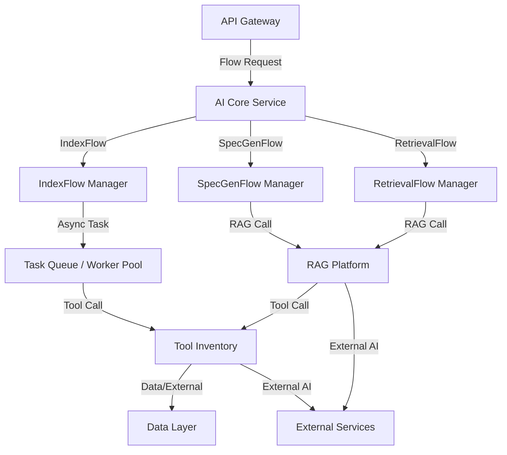

# 3.3 - AI Core Service

## Vai trò
- Là trung tâm xử lý logic AI, điều phối các workflow chính: Indexing, Spec Generation, Retrieval.
- Quản lý các flow nghiệp vụ liên quan đến tri thức, truy xuất, sinh tài liệu.
- Giao tiếp với các thành phần nền tảng RAG, Worker, Tool Inventory và các dịch vụ AI bên ngoài.

## Chức năng chính
- Nhận và xử lý các yêu cầu từ API Gateway (indexing, spec gen, retrieval, ...).
- Điều phối các flow: IndexFlow, SpecGenFlow, RetrievalFlow.
- Giao tiếp với Worker để thực thi các tác vụ bất đồng bộ.
- Giao tiếp với RAG Platform để thực hiện các tác vụ liên quan đến RAG (Retrieval Augmented Generation).
- Quản lý trạng thái workflow, trả kết quả về API Gateway.

## Giao tiếp với các thành phần khác
- Nhận request từ API Gateway.
- Gửi tác vụ đến Worker (Task Queue / Worker Pool).
- Giao tiếp với RAG Platform để thực hiện indexing, retrieval, spec gen.
- Giao tiếp với Tool Inventory để sử dụng các công cụ hỗ trợ.
- Nhận/trả dữ liệu từ/đến Data Layer và các dịch vụ AI bên ngoài (nếu cần).

## Sơ đồ minh họa

## Lưu ý đặc biệt
- Thiết kế module hóa, dễ mở rộng các flow mới.
- Đảm bảo khả năng theo dõi trạng thái workflow, retry khi lỗi.
- Có thể tích hợp nhiều nền tảng RAG hoặc AI provider khác nhau. 