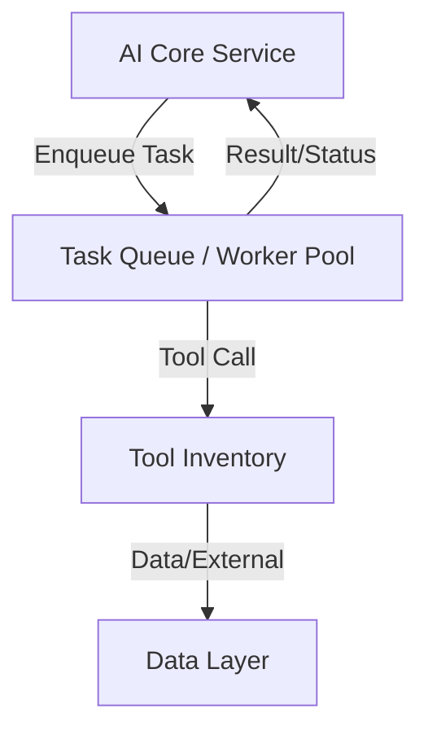

# 3.4 - Task Queue / Worker Pool

## Vai trò
- Thực thi các bước/tác vụ trong workflow một cách bất đồng bộ (asynchronous).
- Đảm bảo các tác vụ nặng, lâu hoặc cần thực hiện song song không làm nghẽn hệ thống chính.
- Tăng khả năng mở rộng, chịu tải cho hệ thống.

## Chức năng chính
- Nhận và xếp hàng (enqueue) các tác vụ từ AI Core Service (Indexing, Tool Call, ...).
- Quản lý pool các worker để thực thi tác vụ song song hoặc theo thứ tự ưu tiên.
- Theo dõi trạng thái, retry khi tác vụ lỗi, log kết quả thực thi.
- Giao tiếp với Tool Inventory để thực hiện các thao tác chuyên biệt (tool call, extract, ...).
- Trả kết quả về cho AI Core Service hoặc lưu vào Data Layer nếu cần.

## Giao tiếp với các thành phần khác
- Nhận tác vụ từ AI Core Service (IndexFlow, ...).
- Giao tiếp với Tool Inventory để thực thi các tool call.
- Trả kết quả về AI Core Service hoặc Data Layer.

## Sơ đồ minh họa

## Lưu ý đặc biệt
- Sử dụng Celery, RabbitMQ.
- Đảm bảo khả năng mở rộng số lượng worker linh hoạt.
- Theo dõi, log, và cảnh báo khi tác vụ lỗi hoặc bị treo lâu. 