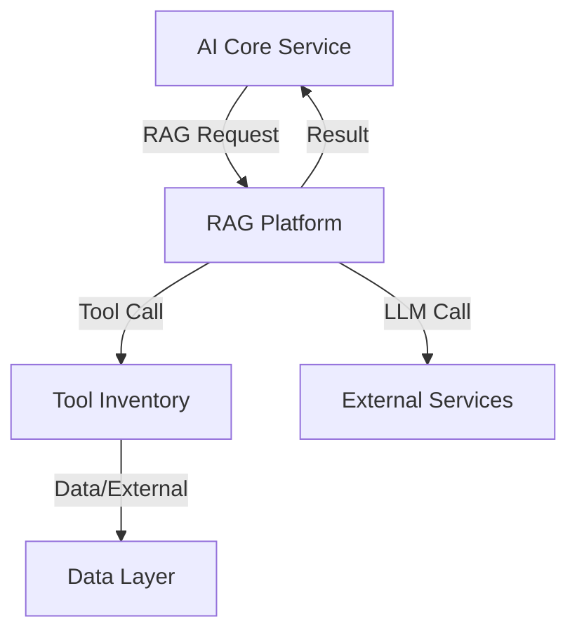

# 3.5 - RAG Platform

## Vai trò
- Nền tảng thực hiện các tác vụ Retrieval Augmented Generation (RAG): indexing, retrieval, spec generation.
- Kết nối, điều phối giữa AI Core Service, Tool Inventory và các dịch vụ AI/LLM bên ngoài.
- Đóng vai trò trung gian, chuẩn hóa các workflow RAG cho toàn hệ thống.

## Chức năng chính
- Nhận yêu cầu retrieval, spec gen từ AI Core Service.
- Thực hiện các pipeline RAG: phân tích, trích xuất, embedding, lưu trữ, truy xuất.
- Giao tiếp với Tool Inventory để sử dụng các công cụ hỗ trợ (extract, phân tích code, ...).
- Giao tiếp với các dịch vụ AI/LLM bên ngoài (OpenAI, Gemini, Cohere, ...).
- Chuẩn hóa kết quả trả về cho AI Core Service.

## Giao tiếp với các thành phần khác
- Nhận yêu cầu từ AI Core Service (SpecGenFlow, RetrievalFlow).
- Giao tiếp với Tool Inventory để thực hiện các thao tác chuyên biệt.
- Giao tiếp với các dịch vụ AI/LLM bên ngoài.
- Trả kết quả về AI Core Service.

## Sơ đồ minh họa

## Lưu ý đặc biệt
- Có thể tích hợp nhiều nền tảng RAG khác nhau (Dify, LangGraph, ...).
- Chuẩn hóa API nội bộ để dễ dàng mở rộng, thay thế nền tảng RAG.
- Đảm bảo bảo mật khi giao tiếp với dịch vụ AI bên ngoài. 