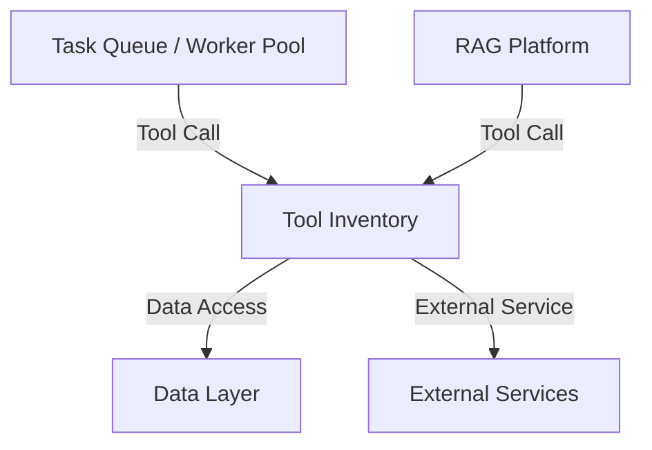

# 3.6 - Tool Inventory (MCP Tool Server)

## Vai trò
- Cung cấp tập hợp các công cụ (tool) phục vụ cho các workflow AI, RAG, indexing, phân tích code, trích xuất thông tin, v.v.
- Là điểm tập trung để quản lý, mở rộng, tích hợp các tool nội bộ hoặc bên ngoài.
- Đóng vai trò trung gian giữa các service (AI Core, Worker, RAG Platform) và các nguồn dữ liệu, dịch vụ ngoài.

## Chức năng chính
- Nhận yêu cầu thực thi tool từ Worker hoặc RAG Platform.
- Quản lý danh mục tool: đăng ký, cập nhật, kiểm tra trạng thái tool.
- Thực thi các tool: code analysis, extract, transform, validate, ...
- Giao tiếp với Data Layer để đọc/ghi dữ liệu cần thiết cho tool.
- Giao tiếp với các dịch vụ ngoài (nếu tool cần).
- Trả kết quả về cho service đã gọi tool (Worker hoặc RAG Platform).

## Giao tiếp với các thành phần khác
- Nhận yêu cầu từ Worker, RAG Platform.
- Giao tiếp với Data Layer để truy xuất dữ liệu.
- Giao tiếp với các dịch vụ ngoài (nếu cần).
- Trả kết quả về cho service đã gọi tool.

## Sơ đồ minh họa

## Lưu ý đặc biệt
- Thiết kế mở để dễ dàng tích hợp thêm tool mới (plugin, microservice, ...).
- Đảm bảo an toàn, kiểm soát truy cập khi thực thi tool.
- Theo dõi, log, và cảnh báo khi tool lỗi hoặc có vấn đề bảo mật. 