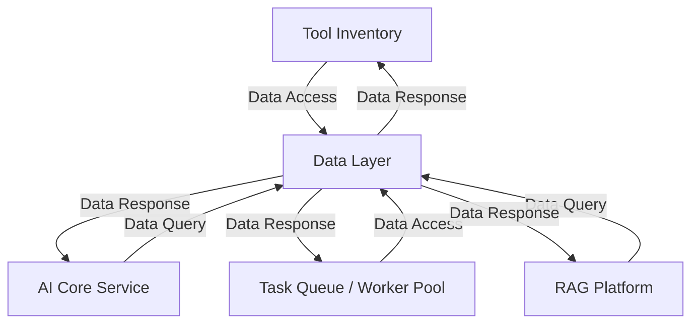

# 3.7 - Data Layer

## Vai trò
- Lưu trữ, quản lý và cung cấp dữ liệu cho toàn bộ hệ thống.
- Hỗ trợ nhiều loại dữ liệu: metadata, embedding, quan hệ, văn bản, ...
- Đảm bảo tính toàn vẹn, bảo mật và hiệu năng truy xuất dữ liệu.

## Chức năng chính
- Lưu trữ metadata dự án, user, workflow (Relational DB).
- Lưu trữ embedding vector cho code/spec (Vector DB).
- Lưu trữ quan hệ, dependency graph (Graph DB).
- Lưu trữ full text index cho tìm kiếm (Text DB).
- Cung cấp API truy xuất, cập nhật, tìm kiếm dữ liệu cho các service khác.
- Đảm bảo backup, phục hồi, bảo mật dữ liệu.

## Giao tiếp với các thành phần khác
- Nhận truy vấn, cập nhật từ Tool Inventory, AI Core Service, Worker, RAG Platform.
- Trả dữ liệu cho các service gọi đến.

## Sơ đồ minh họa

## Lưu ý đặc biệt
- Có thể triển khai nhiều loại DB: PostgreSQL, Milvus, Neo4j, ElasticSearch, ...
- Đảm bảo phân quyền truy cập dữ liệu theo từng service.
- Theo dõi, log, và backup dữ liệu định kỳ. 