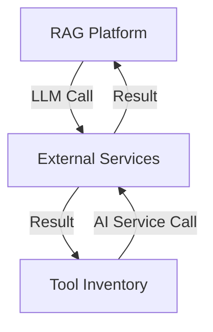

# 3.8 - External Services

## Vai trò
- Cung cấp các dịch vụ AI/LLM bên ngoài (OpenAI, Gemini, Cohere, ...), hỗ trợ các workflow RAG, sinh tài liệu, phân tích ngữ nghĩa, embedding, ...
- Bổ sung năng lực AI cho hệ thống mà không cần tự triển khai mô hình lớn nội bộ.

## Chức năng chính
- Nhận yêu cầu từ RAG Platform hoặc Tool Inventory để thực hiện các tác vụ AI/LLM (inference, embedding, ...).
- Trả kết quả về cho service gọi (RAG Platform hoặc Tool Inventory).
- Hỗ trợ nhiều loại dịch vụ AI/LLM khác nhau, có thể mở rộng.

## Giao tiếp với các thành phần khác
- Nhận yêu cầu từ RAG Platform hoặc Tool Inventory.
- Trả kết quả về cho service đã gọi.

## Sơ đồ minh họa

## Lưu ý đặc biệt
- Đảm bảo bảo mật, kiểm soát truy cập khi giao tiếp với dịch vụ ngoài.
- Theo dõi chi phí, quota, và hiệu năng khi sử dụng dịch vụ AI/LLM bên ngoài.
- Có thể tích hợp nhiều provider khác nhau, chuyển đổi linh hoạt khi cần. 