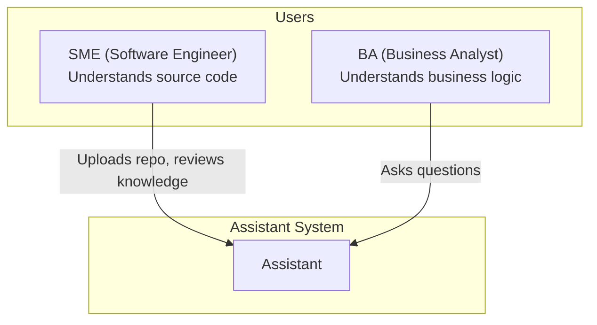
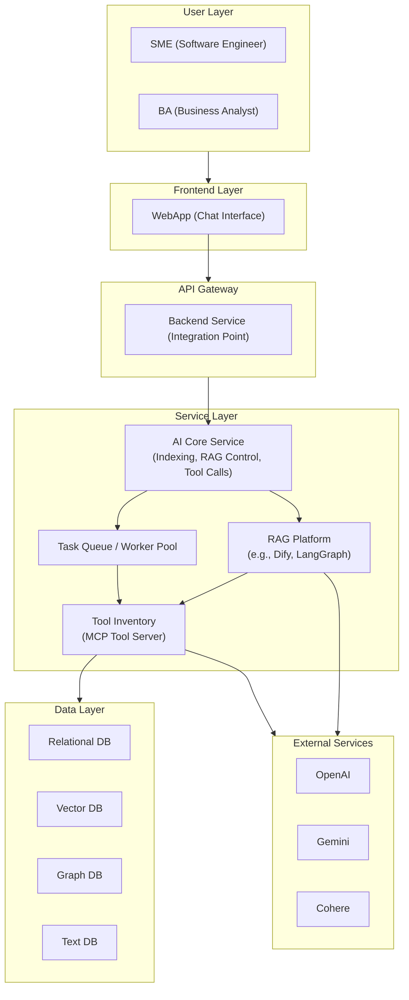

# 1. Context:

- SME tương tác với Assistant để upload source code, kiểm tra kiến thức mà AI xây dựng và tinh chỉnh lại.
- BA sử dụng Assistant để đặt câu hỏi và tạo tài liệu dựa trên tri thức được xây dựng.
- Assistant hoạt động cục bộ (Local), không kết nối với hệ thống ngoài.

# 2. Container:

# 3. Component

- [3.1 - Web App (Chat Interface)](3.1-WebApp.md)
- [3.2 - API Gateway (Backend Service)](3.2-APIGateway.md)
- [3.3 - AI Core Service](3.3-AICoreService.md)
- [3.4 - Task Queue / Worker Pool](3.4-TaskQueueWorkerPool.md)
- [3.5 - RAG Platform](3.5-RAGPlatform.md)
- [3.6 - Tool Inventory (MCP Tool Server)](3.6-ToolInventory.md)
- [3.7 - Data Layer](3.7-DataLayer.md)
- [3.8 - External Services](3.8-ExternalServices.md)

