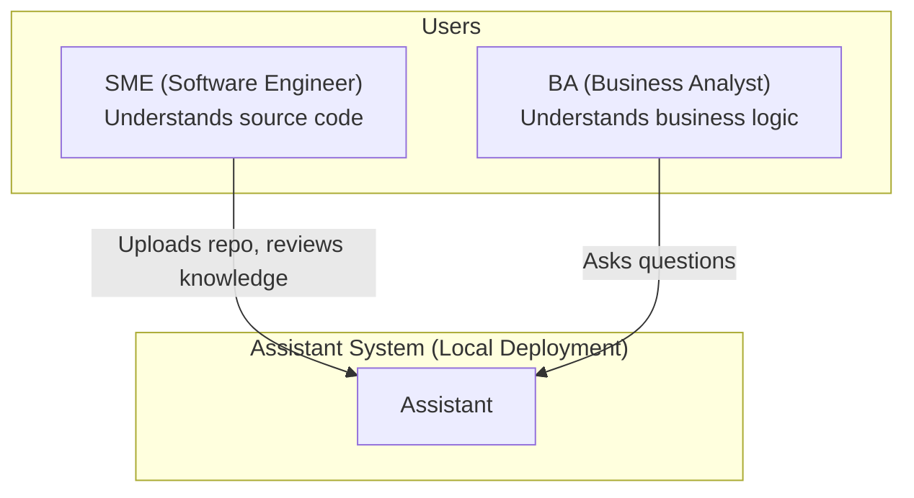
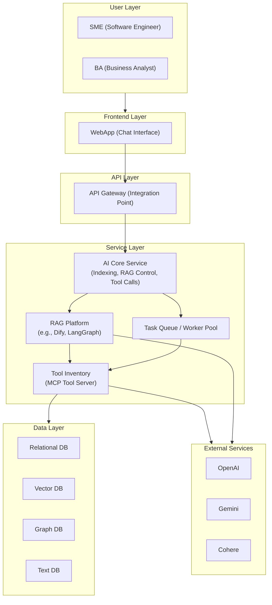
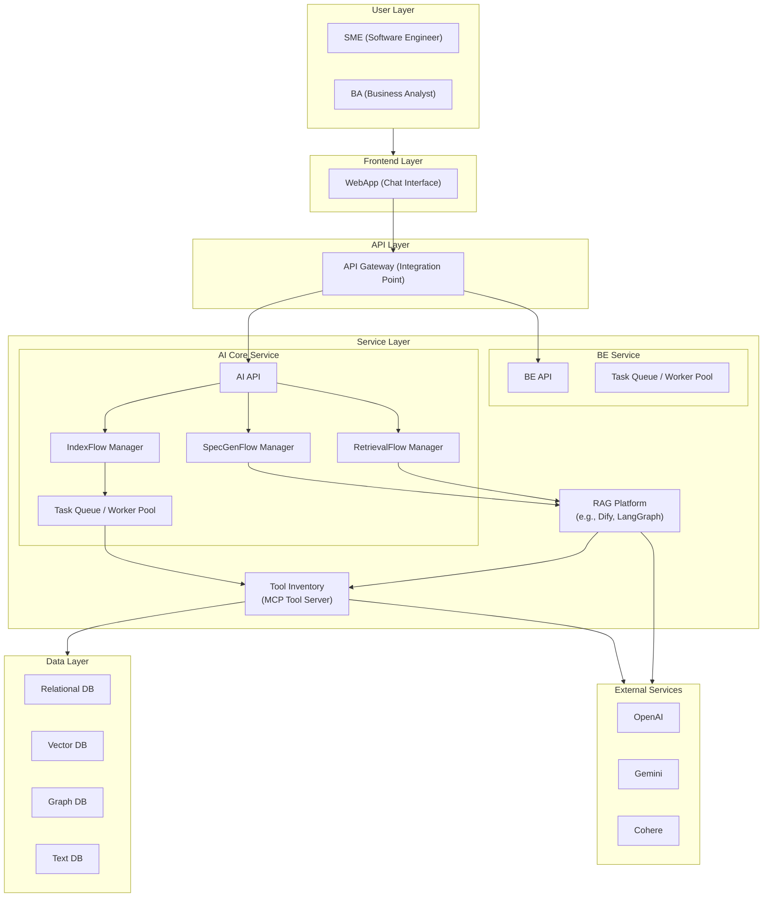

# 1. Context:

- SME tương tác với Assistant để upload source code, kiểm tra kiến thức mà AI xây dựng và tinh chỉnh lại.
- BA sử dụng Assistant để đặt câu hỏi và tạo tài liệu dựa trên tri thức được xây dựng.
- Assistant hoạt động cục bộ (Local), không kết nối với hệ thống ngoài.

# 2. Container:

# 3. Component

## AI Core Service

- IndexFlow Manager
    - Workflow for indexing Repo source code (define in RAG platform)
    - Workflow for indexing Generated Specs (define in RAG platform)
- SpecGenFlow Manager
    - Workflow for generating Specification
- RetrievalFlow Manager
    - Workflow for retrieve context for QA    
- Task Queue / Worker Pool:
    - Async & Distributed workload
