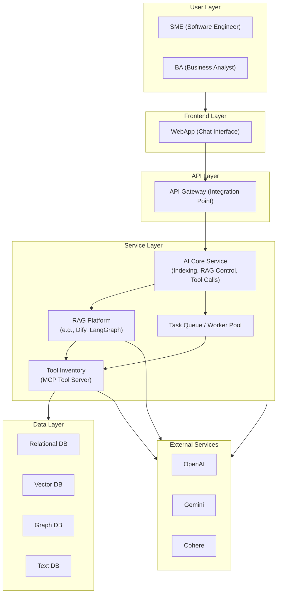
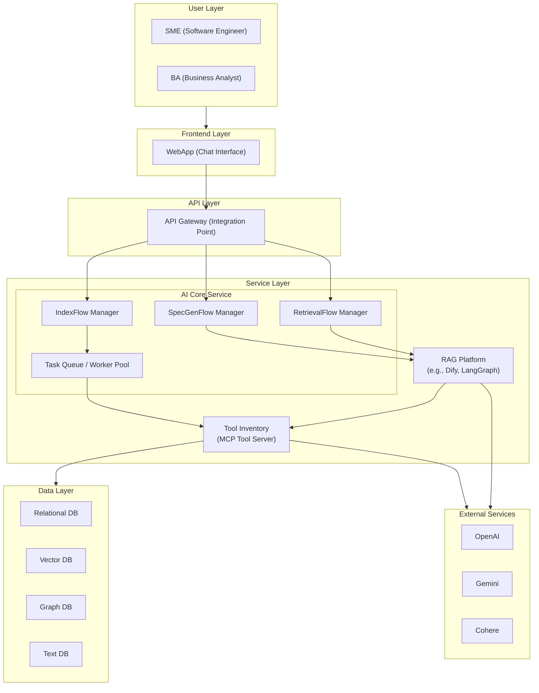

# 1. Context:

- SME tương tác với Assistant để upload source code, kiểm tra kiến thức mà AI xây dựng và tinh chỉnh lại.
- BA sử dụng Assistant để đặt câu hỏi và tạo tài liệu dựa trên tri thức được xây dựng.
- Assistant hoạt động cục bộ (Local), không kết nối với hệ thống ngoài.

# 2. Component:

# 3. Component

- IndexFlow Manager
    - Workflow for indexing Repo source code
    - Workflow for indexing Generated Specs
    - 

RAG Orchestrator

Task Queue / Worker Pool
