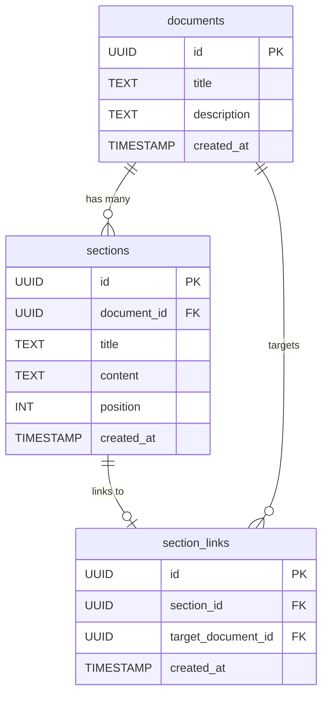

```mermaid

erDiagram

    documents {
        UUID id PK
        TEXT title
        TEXT description
        TIMESTAMP created_at
    }

    sections {
        UUID id PK
        UUID document_id FK
        TEXT title
        TEXT content
        INT position
        TIMESTAMP created_at
    }

    section_links {
        UUID id PK
        UUID section_id FK
        UUID target_document_id FK
        TIMESTAMP created_at
    }

    documents ||--o{ sections : "has many"
    sections ||--o| section_links : "links to"
    section_links }o--|| documents : "targets"


```
