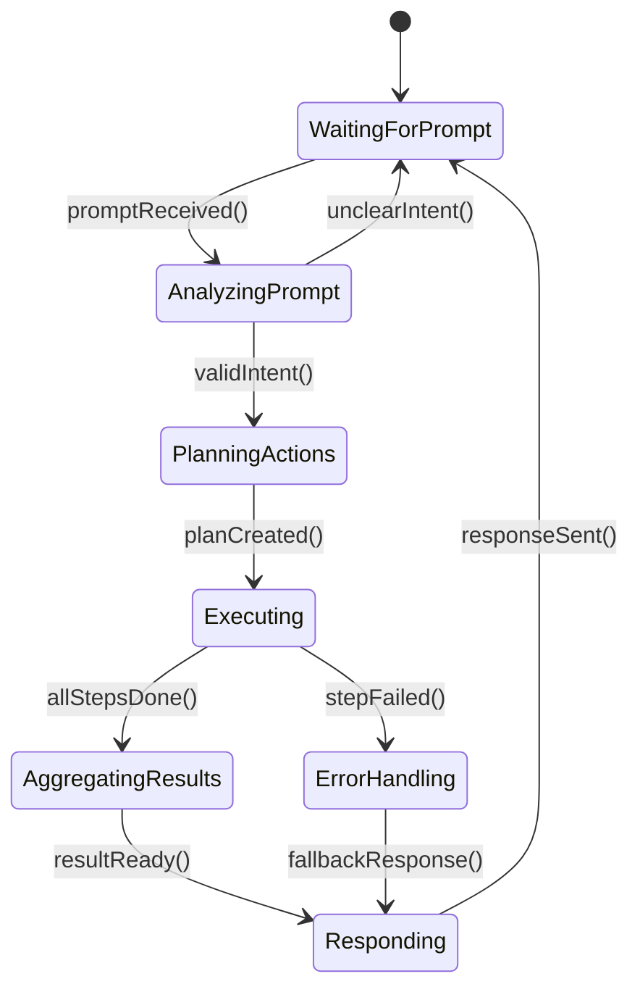

```mermaid

stateDiagram-v2
    [*] --> WaitingForPrompt
    WaitingForPrompt --> AnalyzingPrompt : promptReceived()
    AnalyzingPrompt --> PlanningActions : validIntent()
    AnalyzingPrompt --> WaitingForPrompt : unclearIntent()
    PlanningActions --> Executing : planCreated()
    Executing --> AggregatingResults : allStepsDone()
    AggregatingResults --> Responding : resultReady()
    Responding --> WaitingForPrompt : responseSent()
    Executing --> ErrorHandling : stepFailed()
    ErrorHandling --> Responding : fallbackResponse()

```
