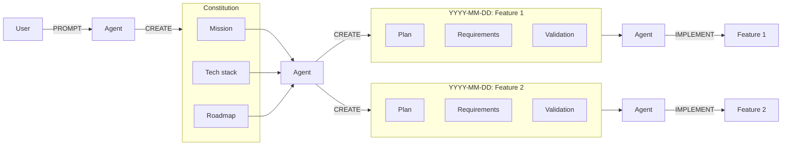

```mermaid

  graph LR
  user["User"]
  agent1["Agent"]
  
  subgraph constitution["Constitution"]
    mission["Mission"]
    techstack["Tech stack"]
    roadmap["Roadmap"]
  end

  user --"PROMPT"--> agent1
  agent1 --"CREATE"--> constitution

  subgraph feature_spec1["YYYY-MM-DD: Feature 1"]
    f1.plan["Plan"]
    f1.requirements["Requirements"]
    f1.validation["Validation"]
  end

  subgraph feature_spec2["YYYY-MM-DD: Feature 2"]
    f2.plan["Plan"]
    f2.requirements["Requirements"]
    f2.validation["Validation"]
  end

  mission --> agent2["Agent"]
  techstack --> agent2
  roadmap --> agent2

  agent2 --CREATE--> feature_spec1
  agent2 --CREATE--> feature_spec2

  feature_spec1 --> agent3["Agent"]
  agent3 --IMPLEMENT--> feature1["Feature 1"]

  feature_spec2 --> agent4["Agent"]
  agent4 --IMPLEMENT--> feature2["Feature 2"]

```
